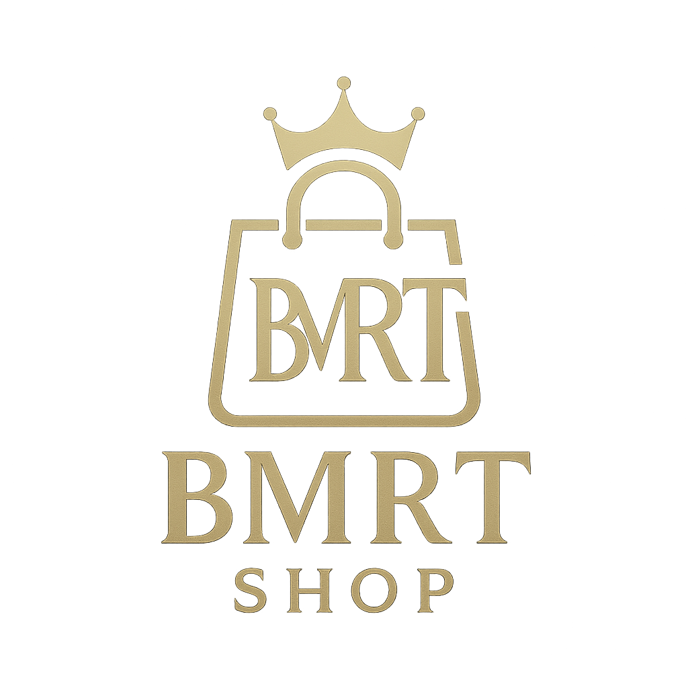

# BMRT Shop



Aplikasi toko jam tangan berbasis Flutter dengan integrasi Firebase.

## 📱 Deskripsi

BMRT Shop adalah aplikasi mobile yang menyediakan platform untuk berbelanja jam tangan dari berbagai merek ternama seperti G-Shock, Seiko, Fossil, dan lainnya. Aplikasi ini dibangun menggunakan Flutter dan Firebase untuk memberikan pengalaman berbelanja yang aman dan nyaman.

## ✨ Fitur Utama

- 🔐 Autentikasi pengguna dengan Firebase
- 📱 Katalog produk jam tangan
- 🎯 Carousel banner untuk promosi
- 🛒 Manajemen keranjang belanja
- 📸 Integrasi dengan Firebase Storage untuk gambar
- 📍 Geolokasi untuk fitur pengiriman
- 🎨 UI/UX yang modern dan responsif
- 🔍 Pencarian produk
- ❤️ Wishlist produk
- 📦 Manajemen transaksi
- 🔔 Notifikasi

## 🛠️ Teknologi yang Digunakan

- Flutter SDK (>=3.2.3)
- Firebase
  - Authentication
  - Firestore
  - Storage
- Provider untuk state management
- Google Fonts untuk tipografi
- Geolocator untuk layanan lokasi
- Carousel Widget untuk tampilan slider
- Logger untuk logging
- Intl untuk format tanggal dan waktu
- UUID untuk generate ID unik

## 📋 Persyaratan Sistem

- Flutter SDK versi 3.2.3 atau lebih tinggi
- Dart SDK versi 3.2.3 atau lebih tinggi
- Firebase CLI
- Android Studio / VS Code dengan Flutter extension
- Git

## 🚀 Instalasi

1. Clone repository ini
```bash
git clone https://github.com/Dyberttt/bmrt_shop.git
```

2. Masuk ke direktori proyek
```bash
cd bmrt_shop
```

3. Install dependencies
```bash
flutter pub get
```

4. Konfigurasi Firebase
   - Buat project Firebase baru
   - Tambahkan aplikasi Android/iOS
   - Download dan tambahkan file konfigurasi Firebase
   - Jalankan `flutterfire configure`

5. Jalankan aplikasi
```bash
flutter run
```

## 📁 Struktur Proyek

```
lib/
  ├── main.dart                 # Entry point aplikasi
  ├── models/                   # Model data
  │   ├── cart_item.dart
  │   ├── product.dart
  │   └── transaction.dart
  ├── screens/                  # Halaman aplikasi
  │   ├── account_screen.dart
  │   ├── cart_screen.dart
  │   ├── category_screen.dart
  │   ├── checkout_screen.dart
  │   ├── home_screen.dart
  │   ├── login_screen.dart
  │   ├── notification_screen.dart
  │   ├── product_detail_screen.dart
  │   ├── promo_screen.dart
  │   ├── register_screen.dart
  │   ├── search_screen.dart
  │   ├── splash_screen.dart
  │   ├── transaction_detail.dart
  │   ├── transaction_detail_screen.dart
  │   ├── transaction_screen.dart
  │   ├── video_screen.dart
  │   └── wishlist_screen.dart
  ├── services/                 # Layanan
  │   ├── auth_service.dart
  │   ├── product_service.dart
  │   ├── seed_data.dart
  │   └── transaction_service.dart
  ├── utils/                    # Utilitas
  │   └── utils.dart
  └── widgets/                  # Widget kustom
      ├── cart_icon.dart
      └── main_button.dart
```

## 👥 Tim Pengembang

### Anggota Kelompok
1. Adam Dalfato - 22101152610000
2. Benny Aprijuanda - 22101152610298
3. Firman Chandra - 22101152610306
4. Rozy Dinata - 22101152610326

### Kontak
- Email: vxchann@gmail.com
- GitHub: https://github.com/Dyberttt/bmrt_shop

## 🤝 Kontribusi

Silakan buat pull request untuk kontribusi. Untuk perubahan besar, harap buka issue terlebih dahulu untuk mendiskusikan perubahan yang diinginkan.

## 📝 Lisensi

[MIT License](LICENSE)

## 🙏 Terima Kasih

Terima kasih telah menggunakan BMRT Shop! Jika Anda memiliki pertanyaan atau saran, silakan buka issue di repository ini.
